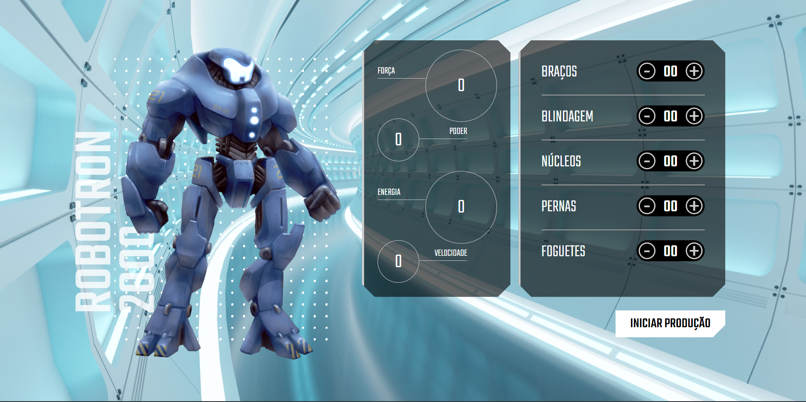

# Bem-vindo ao repositório Robotron 2000!

Este repositório foi criado para o curso de JavaScript "Manipulando o DOM", com o objetivo de ensinar técnicas fundamentais para a manipulação dinâmica de páginas web usando JavaScript.

O projeto Robotron 2000 é uma simulação de uma invasão alienígena na Terra. No curso iremos montar nosso próprio robô de combate, adicionando peças à engrenagem que compõe o robô e visualizando as estatísticas atualizadas em tempo real, tudo isso por meio do JavaScript.

## Tópicos de aprendizagem incluem:

- Interação do JavaScript com HTML e CSS.
- Utilizando o JavaScript para tornar uma página dinâmica;
- Manipulação de dados, eventos e elementos com JavaScript;
- Explore, crie e declare funções no JavaScript;

**O projeto já possui os arquivos de HTML e CSS providos pelo professor, para que o foco seja exclusivamente no desenvolvimento em JavaScript.**

## 🔨 Funcionalidades do projeto

- Adicionar peças;

## ✔️ Técnicas e tecnologias utilizadas

- `JavaScript`;

## 🛠️ Abrir e rodar o projeto

[Robotron-2000](https://robotron-2000-zeta-eight.vercel.app/)

## 📚 Mais informações do curso

Curso de JavaScript: manipulando o DOM

Carga Horária: 6H

- [Alura](https://cursos.alura.com.br/course/javascript-manipulando-dom)